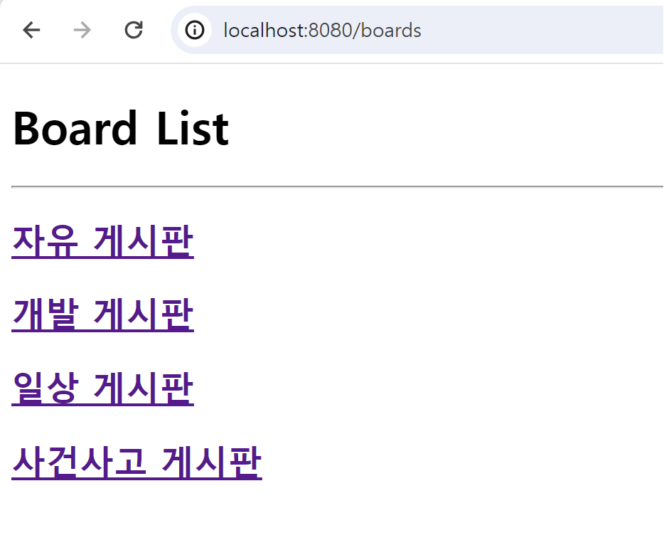

# likelion-backend-8-project
익명 의견 교환 웹 페이지
### 프로젝트 개요
---

사용자들이 자기 자신의 정보를 직접 드러낼 필요 없이 의견을 교환할 수 있는 웹 페이지를 만들어보아요!
단, 자신이 누군지를 드러낼 필요는 없지만 작성한 사람이 원한다면 수정 ∙ 삭제는 가능해야합니다.

---
# 진행 상황
- 필수 과제 구현 완료
- 추가 과제 검색 기능 구현 완료
- 현재 추가과제인 해시태그 부분 개발중이라 해당 코드 데이터 남아있음
- 게시글 생성 시 해시태그 입력해도 추가되지 않음
- 필수 과제 작동 시에는 문제 없으나, 해시태그 입력 후 엔터키 누르면 게시글 작성되니 유의 -> 해시태그 기능 완성 필요

# Entity

## 미션 수행
1. [게시판](#1-게시판-기능)
2. [게시글](#2-게시글-기능)
3. [댓글](#3-댓글-기능)
4. [도전 과제](#도전-과제)
---

## Board - Article

## Article - Comment

## Article - Hashtag
.png)

## Borad

- 게시판의 이름 담겨 있음
- 하나의 게시판이 여러개의 게시글을 가질 수 있음 → `@OneToMany`

### Entity

```java
// 게시글
@Entity
@Getter
@Setter
public class Board {
    @Id
    @GeneratedValue(strategy = GenerationType.IDENTITY)
    private Long id;

    private String name; // 게시판 종류

   // 하나의 게시판이 여러개의 게시글을 가짐
    @OneToMany(mappedBy = "board")
    private List<Article> articles;
}
```

### Repository

```java
import com.example.missionproject.entity.Board;
import org.springframework.data.jpa.repository.JpaRepository;

public interface BoardRepository extends JpaRepository <Board, Long> {}
```
## Article

- 게시글 저장
- 여러 개시글이 하나의 게시판 주제를 가짐 → `@ManyToOne`
- 하나의 게시글은 여러 댓글 가짐 → `@OneToMa`
- 해시태그 추가 중

### Entity

```java
// 게시글
@Entity
@Getter
@Setter
public class Article {
    @Id
    @GeneratedValue(strategy = GenerationType.IDENTITY)
    private Long id;

    private String title; // 게시글 제목
    private String content; // 게시글 내용
    private String author; // 게시글 작성자
    private String password; // 비밀번호

    // 여러 게시글이 하나의 게시판 주제를 가짐
    @ManyToOne
    @JoinColumn(name = "board_id")
    private Board board;

    // 하나의 게시글은 여러 댓글을 가짐
    @OneToMany(mappedBy = "article")
    private List<Comment> comments;

		// 해시태그와 게시글 다대 다 관계
    @OneToMany(mappedBy = "article")
    private List<ArticleHashtag> articleHashtags = new ArrayList<>();
}
```

### Repository

```java
import com.example.missionproject.entity.Article;
import org.springframework.data.jpa.repository.JpaRepository;

public interface ArticleRepository extends JpaRepository <Article, Long> {}
```

## Coment

- 댓글 저장
- 여러 댓글은 하나의 게시글에 달림

### Entity

```java
// 댓글
@Entity
@Getter
@Setter
public class Comment {
    @Id
    @GeneratedValue(strategy = GenerationType.IDENTITY)
    private Long id;
    private String name; // 작성자
    private String password; // 비밀번호
    private String content; // 댓글 내용

    // 여러 댓글은 하나의 게시글에 달림
    @ManyToOne
    @JoinColumn(name = "article_id")
    private Article article;
}
```

### Repository

```java
import com.example.missionproject.entity.Comment;
import org.springframework.data.jpa.repository.JpaRepository;

public interface CommentRepository extends JpaRepository <Comment, Long> {}
```

## Article - Hashtag

- 해시태그와 Article 다대 다(N:M) 관계
- 연결 테이블 용 엔티티 추가 → AricleHashtag.java
- `@ManyToMany` → `@OneToMany` ← `@ManyToOne`
- 엔티티 테이블은 구현되어 있지만, 기능 적용 되어있지 않음 (추후 해시태그 기능 추가 예정)
- Hashtag.java

```java
@Entity
@Getter
@Setter
public class Hashtag {
    @Id
    @GeneratedValue(strategy = GenerationType.IDENTITY)
    private Long id;
    private String hashtag;

    // 해시태그와 게시글 다대 다 관계
    @OneToMany(mappedBy = "hashtag")
    private List<ArticleHashtag> articleHashtags = new ArrayList<>();
}
```

- AricleHashtag.java

```java
// 연결 테이블용 엔티티
@Entity
@Getter
@Setter
public class ArticleHashtag {
    @Id
    @GeneratedValue(strategy = GenerationType.IDENTITY)
    private Long id;

    @ManyToOne
    @JoinColumn(name = "article_id")
    private Article article;

    @ManyToOne
    @JoinColumn(name = "hashtag_id")
    private Hashtag hashtag;
}
```

---

# Function

## 설정

### Dependency

- Spring Web
- JPA
- Lombok
- DB → SQLite 사용
- build.gradle

```java
dependencies {
	implementation 'org.springframework.boot:spring-boot-starter-data-jpa'
	implementation 'org.springframework.boot:spring-boot-starter-thymeleaf'
	implementation 'org.springframework.boot:spring-boot-starter-web'
	// sqlite
	runtimeOnly 'org.xerial:sqlite-jdbc:3.41.2.2'
	runtimeOnly 'org.hibernate.orm:hibernate-community-dialects:6.2.4.Final'

	compileOnly 'org.projectlombok:lombok'
	annotationProcessor 'org.projectlombok:lombok'
	testImplementation 'org.springframework.boot:spring-boot-starter-test'
}
```

- application.yaml

```java
spring:
  datasource:
    url: jdbc:sqlite:db.sqlite
    driver-class-name: org.sqlite.JDBC

  jpa:
    hibernate:
      ddl-auto: update
    show-sql: false
    database-platform: org.hibernate.community.dialect.SQLiteDialect
    defer-datasource-initialization: true

  sql:
    init:
      mode: always
```

---
# 1. 게시판 기능

- 게시판은 같은 주제의 게시글을 모아둔 단위를 의미한다.

## 게시판의 목록과, 선택된 게시판의 게시글 목록을 볼 수 있는 화면
- 프로젝트를 실행해 `localhost8080:/boards` 로 접근하면 메인 화면인 게시판들이 html 화면에 나타난다.
- 각 게시판은 클릭 시 링크를 통해서 게시판의 게시글이 모여있는 상세 페이지로 이동할 수 있다.

### HTML

- boards-main.html
    - board Entity의 `board.name`에 저장되어 있는 게시판 이름을 불러와 화면에 보여준다.
    - Thymeleaf로 동작하기 때문에, `th:` 사용
        - `th:each` 로 boards 내의 board를 하나씩 가져온다.
        - 게시판 이름을 누르면 게시글 페이지로 연결되어야 한다. 따라서 `th:` 를 사용해 연결시킨다.
        - 연결되는 링크 위치는 `@{/boards/{boardId}(boardId=${board.id})}` 이다.

```html
<div th:each="board : ${boards}">
    <h2>
        <a th:href="@{/boards/{boardId}(boardId=${board.id})}">[[${board.name}]]</a>
    </h2>
</div>
```

- board-details.html
    - /boards/{boardId} 에서 보여질 페이지를 만든다
    - /boards에서 링크를 클릭했을 때 연결될 페이지로 상세 페이지에서 게시판에 속해 있는 게시글들을 볼 수 있다.
    - Thymeleaf로 동작하기 때문에, `th:` 사용한다.
        - `th:if` , `th:unless` 를 사용해 게시판 내에 게시글이 존재하는 경우와 게시글이 존재하지 않는 경우의 html 출력 결과를 다르게 설정한다.

```html
<!-- 게시글이 없을 경우 -->
<div th:if="${board.articles.isEmpty()}">
    <p>게시글이 없습니다.</p>
</div>

<!-- 게시글이 있는 경우 -->
<div th:unless="${board.articles.isEmpty()}" th:each="article : ${sortedArticles}">
    <a th:href="@{/article/{articleId}(articleId=${article.id})}">[[${article.title}]]</a>
</div>

<hr>
<!-- 메인(게시판 리스트)으로 돌아가는 링크 -->
<a href="/boards">Back</a>
```

### Service

- 화면에 링크로 연결될 Board의 이름을 띄우기 위해 Board에서 데이터를 불러와야 한다
- /boards 에서 사용할 Board의 데이터를 전체 읽어올 수 있는 `readAllBoard()` 를 만든다
- /boards/{boardId}에서 사용할 Board의 Id로 Board의 데이터를 불러올 수 있는 `getBoardById(Long boardId)` 를 구현한다.
- BoardService.java

```java
public List<Board> readAllBoard() {
    return boardRepository.findAll();
}

public Board getBoardById(Long boardId) {
    return boardRepository.findById(boardId).orElse(null);
}
```

### Controller

- BoardController class는 `@RequestMapping("boards")` 를 사용하여 하위 항목들을 작성한다.
- /boards를 실행하면 게시판 목록이 보여지는 `boardList()` 를 만든다.
- BoardController.java

```java
// /boards를 실행하면 게시판 목록이 보여짐
// 자유 게시판, 개발 게시판, 일상 게시판, 사건사고 게시판
@GetMapping
public String boardList(Model model) {
    List<Board> boards = boardService.readAllBoard();
    model.addAttribute("boards", boards);
    return "boards/board-main";
}
```

- /boards 에서 게시판 이름을 클릭했을 때 연결되는 페이지에서 게시글을 불러올 수 있도록 `boardDetails()` 을 만든다.

```java
// 각 게시판에 저장되어있는 게시글 불러옴
@GetMapping("/{boardId}")
public String boardDetails(@PathVariable("boardId") Long id, Model model) {
    Board board = boardService.getBoardById(id);
    model.addAttribute("board", board);
    model.addAttribute("sortedArticles", sortedArticles);
    return "boards/board-details";
}
```
### 엔드포인트

- 게시판 보기: `/boards/{:boardId}`
### 실행 결과

- 게시판 목록의 링크를 선택하면, 해당 게시판에 작성된 게시글 제목만 목록으로 출력되는 화면으로 이동
    - 게시판 내에 게시글이 없는 경우와 게시글이 있는 경우로 구분
- 게시판 내에 게시글이 없는 경우
.png)
- 게시판 내에 게시글이 있는 경우
.png)
---

# 2. 게시글 기능

## 게시글을 작성할 수 있다
### HTML

- /boards 에서 게시글을 작성하거나, /boards/{boardId} 에서 게시글 작성하기 버튼을 클릭하면 /boards/{:boardId}/article  페이지로 연결되어 게시글을 생성할 수 있는 화면이 나타난다.
- boards/create-view.html
    - `th:action` 을 사용해 게시글 작성 후 게시글 작성 버튼을 클릭하면 form이 전송된다.
    - `option` 을 사용해 게시글을 작성할 게시판을 선택할 수 있다.
    - 현재 추가 기능인 해시태그 기능 개발 중에 있어 해시태그 입력 칸이 html 상에 남아있긴 하나, 작성 후 폼을 제출해도 데이터베이스에 저장되지 않는다.
        - 이때, 엔터키를 누르면 그대로 게시글이 작성되니 테스트 시 유의가 필요하다.

```html
<form th:action="@{/boards/{boardId}/article(boardId=${board.id})}" method="post">
    <!-- 제목 입력 -->
    <div class="mb-3">
        <label>제목:
            <input type="text" name="title" placeholder="게시글 제목">
        </label>
    </div>
		<!-- 게시판 선택 드롭다운 -->
    <div class="mb-3">
        <label for="boardId">게시판 위치:</label>
        <select name="boardId" id="boardId">
            <option th:each="boardItem : ${boards}" th:value="${boardItem.id}" th:text="${boardItem.name}"></option>
        </select>
    </div>
...중략
<!-- 비밀번호 입력 -->
    <div class="mb-3">
        <label>비밀번호:
            <input type="password" name="password">
        </label>
    </div>

    <!-- 제출 버튼 -->
    <button type="submit">게시글 작성</button>
</form>
```

### Serivce

- 게시글을 생성하기 위한 `create()` 를 만든다.
- Controller에서 parameter로 전달해주어야 하기 때문에, 이를 Service의 메서드에 parameter로 구현한다.
- BoardService.java
    - 게시글이 작성되는 위치를 찾아야 한다.
    - `isPresent()` 를 사용해 해당 값이 존재하는 경우 true를 반환한다.

```java
// 게시글 생성하는 메서드
public void create(
        String title,
        String content,
        String author,
        String password,
        // 게시판의 PK 가져옴
        Long boardId,
        ) {
    // 주어진 정보로 새로운 Article 객체 생성
    Article article = new Article();
    article.setTitle(title);
    article.setContent(content);
    article.setAuthor(author);
    article.setPassword(password);

    // 게시판 이름을 찾는다
    Optional<Board> optionalBoard = boardRepository.findById(boardId);
    // 게시글이 어느 게시판에 작성되는지 게시판을 할당한다
    if (optionalBoard.isPresent()) {
        Board board = optionalBoard.get();
        article.setBoard(board);
    }
    // save
    articleRepository.save(article);
}
```

### Controller

- /{boardId}/article 을 실행했을 때, 게시글을 생성할 수 있는 화면이 보여지는 `createView()` 와 해당 페이지에서 작성된 게시글을 저장할 수 있는 `create()` 를 만든다
- BoardController.java
    - `createView()` 는 단순히 화면이 보여지는 역할만 하기 때문에 `@GetMapping` 을 사용한다.
    - `create()` 는 게시글이 저장되어야 하기 때문에 `@PostMapping` 을 사용한다.
        - 이때, POST 되고 난 후 redirect를 사용해 게시글이 작성된 게시판의 페이지가 보여지게 한다.
    - 저장된 게시글은 항상 마지막에 작성된 게시글이 최상단에 위치할 수 있도록 `boardDetails()` 에 게시글을 정렬하는 로직을 추가한다.

```java
@GetMapping("/{boardId}/article")
public String createView(@PathVariable("boardId")Long id, Model model) {
    Board board = boardService.getBoardById(id);

    // 게시판 전체 이름 가져옴
    List<Board> boards = boardService.readAllBoard();

    model.addAttribute("boards", boards);
    model.addAttribute("board", board);
    model.addAttribute("boardId", id);
    return "boards/create-view";
}
```

```java
// 게시글 생성하기
@PostMapping("/{boardId}/article")
public String create(@RequestParam("title") String title,
                     @RequestParam("content") String content,
                     @RequestParam("author") String author,
                     @RequestParam("password") String password,
                     @RequestParam("boardId") Long boardId
) {
    boardService.create(title, content, author, password, boardId);
    return String.format("redirect:/boards/%d", boardId);
}
```
### 엔드포인트

- 게시글 작성하기: `/boards/{:boardId}/article`
### 실행 결과
.png)
- 게시글이 정상적으로 저장되면 게시판 내에 추가
.png)
  .png)

---

## 게시글 단일 조회 화면
- 게시글이 정상적으로 추가된 다음 각 게시판 별 페이지에서 생성된 게시글을 클릭했을 때 게시글의 상세 내용을 보여준다.

### HTML

- /article/{articleId} 페이지를 열었을 때 게시글의 상세 내용을 볼 수 있는 html 페이지를 작성한다.
- article-view.html
    - 해시태그 기능 추가 중에 있어 해당 화면 게시글의 내용이 출력 된 이후 하단에 해시태그를 보여주는 화면이 존재한다.
    - 현재 기능이 완전히 구현되어 있지 않아, 해시태그는 추가되어 있지 않고, 태그가 없습니다. 메시지가 고정으로 출력된다.
    - 필수 기능 실행에는 영향이 없다.

### Service

- 게시글을 클릭하면 게시글의 상세 내용을 보여주기 위해 Article 내용을 불러오기 위한 `readArticle()` 을 만든다.
- ArticleService.java

```java
// 게시글 클릭하면 상세 게시글 보여줌
public Article readArticle(Long id) {
    Optional <Article> optionalArticle = articleRepository.findById(id);
    return optionalArticle.orElse(null);
}
```

### Controller

- ArticleController class는 `@RequestMapping("article")` 을 지정해 둔다.
- ArticleController.java
    - /article/{articleId}에서 게시글의 상세 페이지가 보여질 수 있게 하는 `readArticle()` 을 만든다.

```java
// 게시글 상세보기
@GetMapping("{articleId}")
public String readArticle(@PathVariable("articleId") Long id, Model model) {
    Article article = articleService.readArticle(id);
    model.addAttribute("article", article);
    model.addAttribute("boardId", article.getBoard().getId());
    return "articles/article-view";
}
```
### 엔드포인트

- 게시글 보기: `/article/{:articleId}`

### 실행 결과
- 게시글이 상세 보기됨
.png)
.png)

--- 

## 게시글을 수정하는 페이지
- /articles/update.html
    - 게시글을 수정할 수 있는 html 페이지가 필요하다.
    - 수정될 게시글의 데이터는 비밀번호를 제외하고, 입력 칸의 화면에 존재한다.
        - 기본 구조는 유사하지만 input에 `th:value` 을 사용해 기존의 게시글 내용을 불러와 수정이 가능하게 한다.
    - 비밀번호가 일치하지 않는 경우는 수정이 되지 않도록 에러 메시지를 출력한다.

```html
<input type="text" name="title" th:value="${article.title}">
```

```html
<!-- 비밀번호 입력 -->
<div class="mb-3">
    <label>비밀번호:
        <input type="password" name="password">
    </label>
    <!-- 비밀번호가 틀린 경우 -->
    <span th:if="${param.error}" style="color: red;">비밀번호가 틀렸습니다.</span>
</div>
```

### Service

- ArticleService.java
    - 게시글 수정하기 위해 비밀번호를 확인하는 메서드인 `isPasswordCorrect()` 가 필요하다.
    - `update()` 로 내용을 업데이트하기 위한 메서드를 만든다.

```java
// 게시글 수정하기 위해 비밀번호를 확인하는 메서드
public boolean isPasswordCorrect(Long id, String password) {
    // 게시글을 가져옴
    Optional<Article> optionalArticle = articleRepository.findById(id);
    // 가져온 게시글의 password와 입력받은 password가 일치하는지 확인
    if (optionalArticle.isPresent()) {
        Article article = optionalArticle.get();
        return article.getPassword().equals(password);
    }
    return false;
}
```

```java
// 업데이트
public void update(Long id, String title, String content, String author, String password) {
    // 비밀번호가 일치하는 경우 대상 데이터 찾음
    Article target = readArticle(id);
    // 데이터의 내용을 전달받은 내용으로 갱신
    target.setTitle(title);
    target.setContent(content);
    target.setAuthor(author);
    target.setPassword(password);
    // save
    articleRepository.save(target);
}
```

### Controller

- `/article/{:articleId}/update` 를 실행했을 때, 게시글을 수정할 수 있는 화면이 보여지는 `updateView()` 와 해당 페이지에서 수정된 게시글을 저장할 수 있는 `updateArticle()` 를 만든다.
- BoardController.java
    - `updateView()` 는 단순히 화면이 보여지는 역할만 하기 때문에 `@GetMapping` 을 사용한다.
    - `updateArticle()` 는 게시글이 저장되어야 하기 때문에 `@PostMapping` 을 사용한다.
        - 이때, POST 되고 난 후 redirect를 사용해 게시글이 수정된 게시글의 페이지가 보여지게 한다.
    - 게시글을 수정하기 전에 비밀번호가 일치하는지 확인하는 로직이 필요하다.

```java
@GetMapping("{articleId}/update")
public String updateView(@PathVariable("articleId")Long id, Model model) {
    Article article = articleService.readArticle(id);
    model.addAttribute("article", article);
    return "articles/update";
}
```

```java
@PostMapping("{articleId}")
public String updateArticle(
        @PathVariable("articleId") Long id,
        @RequestParam("title") String title,
        @RequestParam("content") String content,
        @RequestParam("author") String author,
        @RequestParam("password") String password) {
    // 비밀번호가 일치하는 경우
    if (articleService.isPasswordCorrect(id, password)) {
        articleService.update(id, title, content, author, password);
        return String.format("redirect:/article/%d", id);
    } else {
        // 비밀번호 일치하지 않는 경우
        return String.format("redirect:/article/%d/update?error=true", id);
    }
}
```
### 엔드포인트

- 게시글 수정하기: `/article/{:articleId}/update`
### 실행 결과
.png)
- 틀린 비밀번호를 입력할 경우 수정되지 않고 에러 메세지가 출력된다.
.png)

---

## 게시글 삭제
- 게시글을 상세보기 한 페이지에서 삭제하기 버튼을 클릭했을 때 게시글을 삭제 할 수 있는 화면으로 넘어간다.
- 작성한 사람의 비밀번호가 일치하는 경우에만 게시글 삭제가 가능해야 하며, 비밀번호가 일치하지 않는 경우 게시글의 삭제는 불가능해야 한다.

### HTML

- /articles/delete.html
    - 게시글을 삭제할 수 있는 html 페이지가 필요하다.
    - 게시글을 수정하는 경우와 마찬가지로 비밀번호가 틀린 경우 에러메시지가 출력된다.

### Service

- ArticleService.java
    - 게시글을 삭제하기 위한 `deleteArticle()` 을 만든다

```java
// 게시글 삭제하기
public void deleteArticle(Long id) {
    articleRepository.deleteById(id);
}
```

### Controller

- `/article/{:articleId}/update` 를 실행했을 때, 게시글을 삭할 수 있는 화면이 보여지는 `deleteView()` 와 해당 페이지에서 삭제된 게시글을 데이터에 반영할 수 있는 `deleteArticle()` 를 만든다.
- BoardController.java
    - `deleteView()` 는 단순히 화면이 보여지는 역할만 하기 때문에 `@GetMapping` 을 사용한다.
    - `deleteArticle()` 는 게시글이 삭제되어야 하기 때문에 `@PostMapping` 을 사용한다.
        - 이때, POST 되고 난 후 redirect를 사용해 게시글이 삭제되고 난 후, 게시글이 저장되어 있던 위치가 보여지게 한다.
    - 게시글을 삭제하기 전에 비밀번호가 일치하는지 확인하는 로직이 필요하다.

```java
// 게시글 삭제하기
@GetMapping("{articleId}/delete")
public String deleteView(@PathVariable("articleId") Long id, Model model) {
    Article article = articleService.readArticle(id);
    model.addAttribute("article", article);
    model.addAttribute("boardId", article.getBoard().getId());
    return "articles/delete";
}
```

```java
@PostMapping("{articleId}/delete")
public String deleteArticle(@PathVariable("articleId") Long id,
                            @RequestParam String password,
                            @RequestParam Long boardId) {
    if (articleService.isPasswordCorrect(id, password)) {
        articleService.deleteArticle(id);
        return String.format("redirect:/boards/%d", boardId);
    } else {
        return String.format("redirect:/article/%d/delete?error=true", id);
    }
}
```
### 엔드포인트

- 게시글 삭제하기: `/article/{:articleId}/delete/`

### 실행 결과
.png)
- 틀린 비밀번호를 입력할 경우 삭제되지 않고 에러 메시지가 출력된다.
.png)

---

# 3. 댓글 기능
- 게시글 페이지의 하단에서 댓글이 보여진다.
## 댓글 작성
- 게시글 페이지의 하단에서 댓글 작성하기 버튼을 클릭하면 댓글을 작성할 수 있는 페이지로 넘어간다.

### HTML

- /article/{articleId}/comment  페이지로 연결되어 게시글을 생성할 수 있는 화면이 나타난다.
- /comments/create.html
    - 게시글 작성하는 /articles/create.html 과 유사한 형태이다.
- /articles/article-view.html
    - 댓글을 작성하기 위한 댓글 작성하기 버튼과 작성된 댓글이 차례로 보여지게 하는 html 문을 추가한다.

### Service

- CommentService.java
    - 댓글을 작성하기 위한 `createComment()` 메서드를 만든다.
    - 댓글이 어느 게시글에 저장되어 있는지 찾아 해당 게시글에 댓글로 저장해야 한다.

```java
public void createComment(String name, String password, String content, Long articleId) {
    // 주어진 정보로 새로운 댓글 생성
    Comment comment = new Comment();
    comment.setName(name);
    comment.setPassword(password);
    comment.setContent(content);

    // 게시글 찾음
    Optional<Article> optionalArticle = articleRepository.findById(articleId);
    // 댓글이 어느 게시글에 작성되어 있는지 게시글을 할당한다
    comment.setArticle(optionalArticle.orElse(null));
    // save
    commentRepository.save(comment);
}
```

### Controller

- CommentController.java
    - ArticleController와 마찬가지로 댓글 작성하는 페이지로 이동하는 메서드와 댓글이 작성되어 POST 되는 메서드가 필요하다.

```java
// 댓글 작성하는 view로 이동
@GetMapping("/{articleId}/comment")
public String createView(@PathVariable("articleId") Long id, Model model) {
    Article article = articleService.readArticle(id);
    model.addAttribute("article", article);
    model.addAttribute("articleId", id);
    return "comments/create";
}
```

```java
// 댓글 작성하기
@PostMapping("/{articleId}/comment")
public String createComment(@RequestParam("name") String name,
                            @RequestParam("password") String password,
                            @RequestParam("content") String content,
                            @PathVariable("articleId") Long articleId) {
    commentService.createComment(name, password, content, articleId);
    return String.format("redirect:/article/%d", articleId);
}
```
### 엔드포인트

- 댓글 작성하기: `/article/{:articleId}/comment`

### 실행 결과
.png)
- 댓글이 성공적으로 입력되면 게시글에서 확인이 가능하다.
  .png)
- .png)

---

## 댓글 삭제
- 게시글 페이지의 하단 댓글 목록에서 작성된 댓글 옆 댓글 삭제하기를 클릭하면 댓글을 삭제할 수 있는 페이지로 넘어가 댓글을 삭제할 수 있도록 한다.

### HTML

- comments/delete.html
    - 게시글 작성을 위한 articles/delete.html과 유사하다.

### Service

- CommentService.java

```java
// 댓글 삭제하기
public void deleteComment(Long id) {
      commentRepository.deleteById(id);
  }
```

### Controller

- CommentController.java
    - ArticleController와  마찬가지로 댓글을 삭제하는 페이지로 이동하는 메서드와 댓글을 삭제하는 POST 메서드가 필요하다.
    - 이때, `{articleId}` , `{commentId}` 의 고려가 필요하므로 `@PathVariable` 으로 해당 값을 할당한다.

```java
// 댓글 삭제 페이지로 이동
@GetMapping("/{articleId}/comment/{commentId}/delete")
public String deleteView(@PathVariable("articleId") Long articleId,
                         @PathVariable("commentId") Long id,
                         Model model) {
    // 댓글 읽어옴
    Comment comment = commentService.readComment(id);
    Article article = articleService.readArticle(articleId);

    model.addAttribute("comment", comment);
    model.addAttribute("article", article);
    return "comments/delete";
}
```

```java
@PostMapping("/{articleId}/comment/{commentId}/delete")
public String deleteComment(@PathVariable("articleId") Long articleId,
                            @PathVariable("commentId") Long id,
                            @RequestParam String password) {
    if (commentService.isPasswordCorrect(id, password)) {
        commentService.deleteComment(id);
        return String.format("redirect:/article/%d", articleId);
    } else {
        return String.format("redirect:/article/%d/comment/%d/delete?error=true", articleId, id);
    }
}
```
### 엔드포인트

- 댓글 삭제하기: `/article/{:articleId}/comment/{:commentId}/delete`

### 실행 결과
.png)
- 잘못된 비밀번호를 입력할 경우 에러메세지 출력
  .png)

---
### 추가 구현 (댓글 수정 기능 추가)
### 실행 결과
.png)
- 잘못된 비밀번호 입력된 경우 에러 메시지 출력
.png)

---

# 도전 과제
## 1. 해시태그 기능
- 현재 기능이 구현되어 있지 않고, 엔티티 테이블만 존재한다.
- 게시글 생성 html에 해시태그 input이 들어가있지만, 기능이 완전히 구현된 것은 아니기에 입력해도 DB에 저장되지 않는다.

## 2. 검색 기능

- 조건
    - 게시글 목록을 확인할 수 있는 페이지에, 검색을 위한 UI가 추가된다.
        - 사용자가 검색어를 입력해서 검색을 할 수 있다.
    - 검색을 하면서 검색 기준을 선택할 수 있다.
        - 제목
        - 내용
    - 개별 게시판이 선택된 상태론 해당 게시판 내에서, 전체 게시판이 선택된 상태론 전체 게시글 중 검색한다.
### HTML

- boards/search.html
    - `th:if` , `th:unless` 를 사용하여 검색 결과가 있는 경우와 검색 결과가 없는 경우의 출력 결과를 다르게 한다.
    - 검색 결과가 있는 경우, 해당 게시글의 제목을 클릭하면 해당 게시글의 상세 페이지로 이동 가능하도록 링크로 연결한다.
    - 검색 기준은 제목과 내용으로 이루어져 있다.

### Service

- 검색 기준은 게시글의 제목과 내용으로 이루어져 있다.
    - 제목 기준으로 검색하기 위한 `findByTitleContaining()` 과 `findByContentContaining()` 을 `ArticleRepository` 에 이를 추가한다.
    - 특정 게시판에서 검색한 결과만 얻을 경우 Board의 데이터가 필요하다. 특정 게시판 내에서 검색하기 위한 `findByBoardAndTitleContaining()` 과 `findByBoardAndContentContaining()` 을 각각 추가한다.
- ArticleRepository.java

```java
public interface ArticleRepository extends JpaRepository <Article, Long> {
    // 전체 게시판 검색 결과 (검색 조건 - 제목)
    // 제목에 포함된 키워드를 찾음
    List<Article> findByTitleContaining(String keyword);

    // 전체 게시판 검색 결과 (검색 조건 - 내용)
    // 내용에 포함된 키워드 찾음
    List<Article> findByContentContaining(String keyword);

		// 특정 게시판 내 검색 결과 (검색 조건 - 제목)
    // 특정 게시판 내 검색 결과를 받아오기 위해 Board 데이터 필요
    List<Article> findByBoardAndTitleContaining(Board board, String keyword);

    // 특정 게시판 내 검색 결과 (검색 조건 - 내용)
    List<Article> findByBoardAndContentContaining(Board board, String keyword);
}
```

- BoardService.java
    - 게시글을 검색하기 위해 `search()` 메서드를 구현한다.
    - 해당 메서드는 어떤 기준으로 검색할건지를 확인하는 type과, 검색한 내용인 keyword를 인자로 갖는다.
        - 게시판 전체 대상으로 조회하는 경우 BoardId 는 필요 없지만, 특정 게시판 페이지 내에서 게시글을 검색하는 메서드의 경우 BoardId 또한 파라미터로 주어진다.

```java
// 게시판 전체 검색 기능
public List<Article> searchAllBoards(String type, String keyword) {
    if ("title".equals(type)) {
        // 제목으로 검색
        return articleRepository.findByTitleContaining(keyword);
    } else if ("content".equals(type)) {
        // 내용으로 검색
        return articleRepository.findByContentContaining(keyword);
    }
    return Collections.emptyList();
}
```

```java
// 각 게시판 별 검색 기능 추가
public List<Article> searchArticles(Long boardId, String type, String keyword) {
    Optional<Board> optionalBoard = boardRepository.findById(boardId);
    if (optionalBoard.isPresent()) {
        Board board = optionalBoard.get();

        if ("title".equals(type)) {
            // 제목으로 검색
            return articleRepository.findByBoardAndTitleContaining(board, keyword);
        } else if ("content".equals(type)) {
            // 내용으로 검색
            return articleRepository.findByBoardAndContentContaining(board, keyword);
        }
    }
    return Collections.emptyList();
}
```

### Controller

- BoardController.java
    - 검색된 게시글이 보여지는 페이지로 연결되는 메서드를 만든다.
    - 게시판 전체에서 검색한 게시글인 경우는 /boards/search 페이지로 연결된다.
    - 특정 게시판 내에서 검색한 게시글인 경우는 /boards/{boardId}/search 페이지로 연결된다.

```java
// 게시판 전체에서 게시글 검색하기
@GetMapping("/search")
public String searchAll(@RequestParam("type") String type,
                        @RequestParam("keyword") String keyword,
                        Model model) {
    List <Article> searchArticle = boardService.searchAllBoards(type, keyword);
    model.addAttribute("searchResult", searchArticle);
    return "boards/search-all";
}
```

```java
// 게시판 내 게시글 검색하기
@GetMapping("/{boardId}/search")
public String searchPage(@PathVariable("boardId") Long id,
                         @RequestParam("type") String type,
                         @RequestParam("keyword") String keyword,
                         Model model) {
    List<Article> searchArticle= boardService.searchArticles(id, type, keyword);
    model.addAttribute("boardId", id);
    model.addAttribute("searchResult", searchArticle);
    return "boards/search";
}
```
### 게시판 목록에서 전체 게시글을 검색
.png)

### 실행 결과

- 제목으로 검색한 경우
  .png)
.png)
- 내용으로 검색한 경우
.png)
.png)
